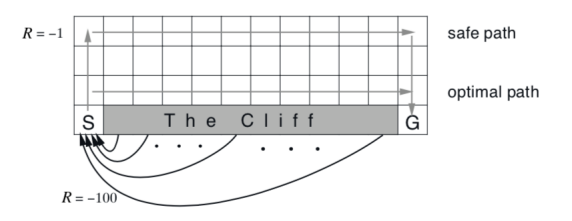
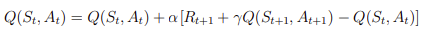
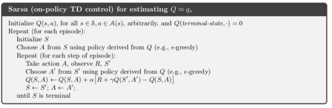
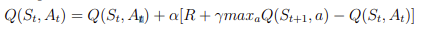
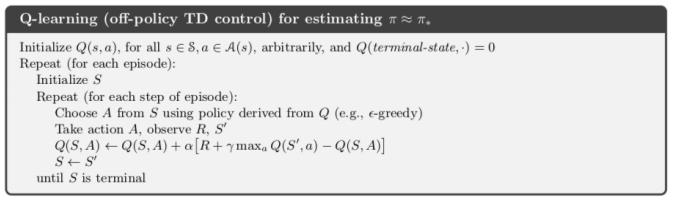
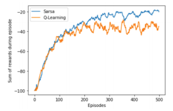

# cliff-walking-task
Re-implemented the resultes presented in Figure 6.4 of the Sutton and Button book comparing SARSA and Q-learning in the cliff-walking task. It is important to note that for this problem, I used 𝛼 = 0.1 and 𝛾 = 1 for both algorithms.

Both Sarsa and Q-learning are temporal difference (TD) learning methods. The benefits of using TD learning is that an agent can learn directly from experience just like with Monte Carlo method; that is, the model of the envrionment is not needed. Furthermore, TD method boostraps which means that it updates estimates based on other learned estimates.

The trade-off exploration and exploitation falls intoo two main classes 1) on-policy (Sarsa) and 2) off-policy (Q-Learning). 

The figure below displays a grid world examples which compares two different methods on-policy and off-policy highlighting the main differences between the mehods. The size of the world has height of 4 and width of 12. This is an espidoci task with the starting state S at [3,0] and goal stage G at [3,11]. The possible actions that an agent can take in a given state are {up, down, right and left}. IT is important to note that every cell, except cell marked with "The Cliff" has reward of -1 when transitioned fro one action-state pair to another one. Otherwise, the reward is -100 if the agent steps into "The Cliff" and sends the agent immediate back to starting state S at [3,0].

## SARSA

Sarsa, acronym for State-Action-Rewards-State-Action, is an on-policy TD control method. The
Sarsa is more concerned with optimizing action value functions Q(S, A), for the current policy π
for all actions pair (a, s) in the current episode, rather than a state value function V(S). This is
done in such a way that the TD update rule is applied at every time step of an episode which allows
the agent transition from one state-action pair to another state-action pair

The Sarsa temporal difference update rule looks as follows:

In Sarsa, the first step is to first arbitrarily initialize all Q(s, a) for all s ∈ S (states) and a ∈ A(s)
(actions) and Q(terminal − state) = 0. This is because the reward Rt+1 at the terminal state and
Q(St+1, At+1) are both 0. Thus, the terminal state is also equal to 0. Secondly, given some number
of episodes, for each episode we repeat the following: Starting from some state S and using the
Ɛ-greedy algorithm to choose some action At+1. The next step is to update the Sarsa learning rule
(as shown in equation 3) and assign S to St+1 and A to At+1 and repeat until S is a terminal state.

## Q-Learning

Q-Learning is an off-policy TD control policy. It is an off-policy because it learns the value of the
optimal policy π independently of the agent’s actions. It is also important to note that Q-learning
uses the same algorithm as Sarsa, but the only difference being that the update rule is different. 
Unlike Sarsa where an action At+1 was selected following some policy π, in Q-learning, the action
At+1 was chosen using the greedy approach by using maxaQ(St+1, a).

The Q-Learning TD update rule looks as follows:

The algorithm for Q-learning is shown below.

# Results

The figure below shows the performance results of the SARSA and Q-learning methods with Ɛ-greedy action selection of Ɛ = 0.1. The results were obtained from 10 runs plotting a moving average over the last 10 episodes.

As it was already mentioned that Q-learning learns the value of the optimal policy  π independenlty of the anget's actions. Due to its nature, the q-learning quickly learned the optimal path as shown below. it is an optimal path because the number of rewards R is higher compared to the safe path that was chosen by SARSA. However, if the agent takes the optimal path then there is a chance that the agent may fall along the edge of the cliff because of the greedy selection algorithm.

The figure below shows the performance of both SARSA and Q-learnng on cliff walking problem. The results show that in this specific problem it is better to use SARSA as the performance is better than that of the Q-learning which uses optimal path but performs worse on average. However, it is not the case that SARSA would operate better than Q-learning in other problems as the performance of SARSA and Q-learning may vary on the problems.

